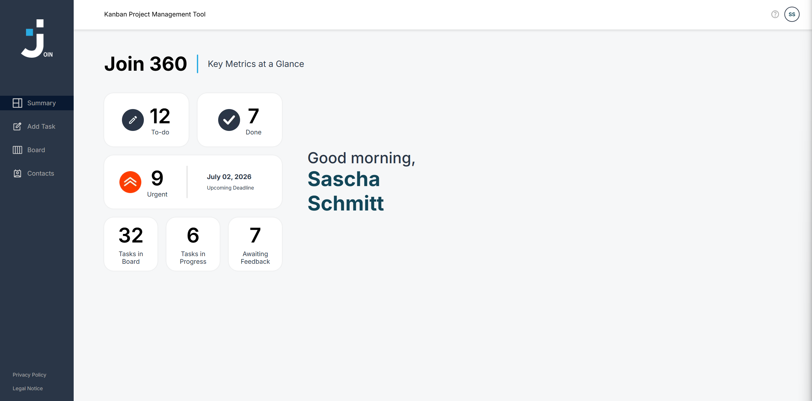
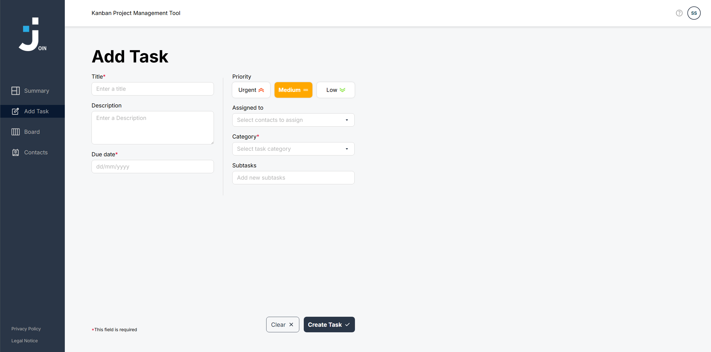
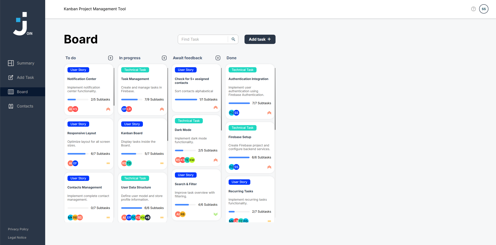
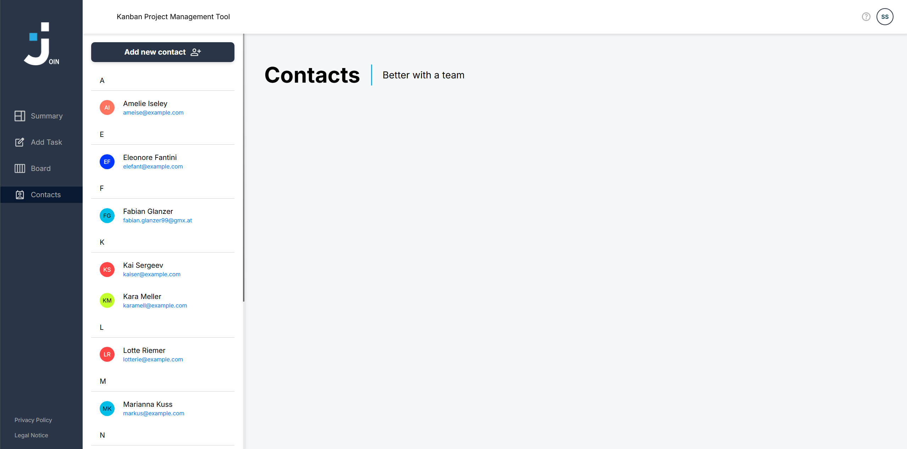
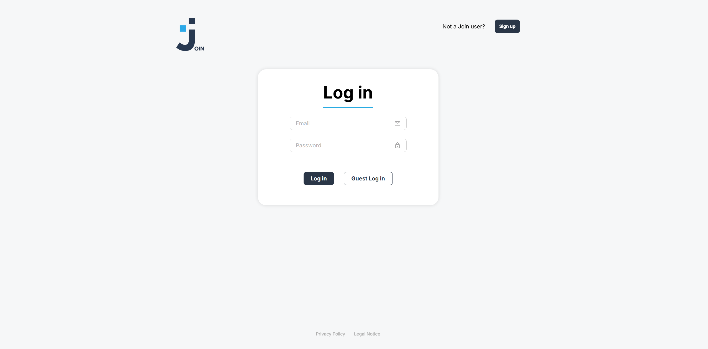

# Join

Join is a responsive Kanban project management application for organizing tasks, tracking progress, and collaborating with a team. It combines a clear task board with contact management, user authentication, subtasks, priorities, and a summary dashboard.



## Features

- Email and password authentication with Firebase Authentication
- Guest login with an isolated guest workspace
- Summary dashboard with task counts and upcoming deadlines
- Kanban board with drag-and-drop task movement
- Task search and filtering
- Create, edit, and delete tasks
- Priorities, categories, due dates, assignments, and subtasks
- Subtask progress tracking directly on task cards
- Contact creation, editing, deletion, and assignment
- Responsive layouts for desktop, tablet, and mobile devices
- Keyboard-accessible dialogs, dropdowns, and navigation

## Screenshots

### Task creation

Create detailed tasks, assign contacts, choose a priority and category, set a due date, and split work into subtasks.



### Kanban board

View tasks across the workflow columns, search the board, and move cards between statuses using drag and drop.



### Contact management

Keep team members organized in an alphabetical contact list and use them as task assignees.



### Authentication

Sign in with an account, create a new account, or explore the application using the guest login.



## Tech Stack

- HTML5
- CSS3
- Vanilla JavaScript
- Firebase Authentication
- Firebase Realtime Database
- Stylelint

## Project Structure

```text
join/
├── assets/          # Icons, fonts, and screenshots
├── scripts/         # Application logic and Firebase integration
├── styles/          # Page and component styles
├── subpages/        # Application pages
├── templates/       # Reusable HTML template functions
├── index.html       # Login page
├── script.js        # Shared utilities and application state
└── style.css        # Global styles
```

## Getting Started

### Prerequisites

You only need a modern web browser and a local static web server. One simple option is the VS Code **Live Server** extension.

### Run locally

1. Clone the repository:

   ```bash
   git clone https://github.com/SaschaSchmitt-Dev/join.git
   ```

2. Open the project directory:

   ```bash
   cd join
   ```

3. Start a local static server from the project root. For example, with Python:

   ```bash
   python -m http.server 5500
   ```

4. Open `http://localhost:5500` in your browser.

The Firebase project configuration used by the application is located in `scripts/firebaseConfig.js`.

## Code Quality

Run the configured CSS linting check with:

```bash
npm install
npm run lint:css
```

## Data and Authentication

Registered users authenticate through Firebase Authentication. Tasks and contacts are stored in Firebase Realtime Database. Guest login prepares a separate guest sandbox so the application can be explored without creating an account.

> [!IMPORTANT]
> Firebase Authentication is not available when testing the application through the GitHub-hosted project. Please use **Guest Log in** to explore and test the application in the isolated guest sandbox.

## Legal Pages

The application includes dedicated privacy policy and legal notice pages, accessible from the login screen and the main navigation.
